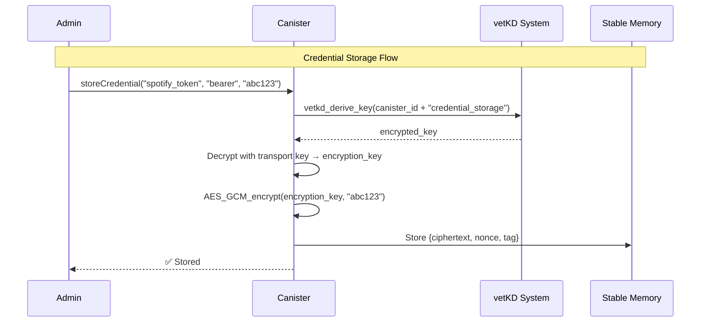
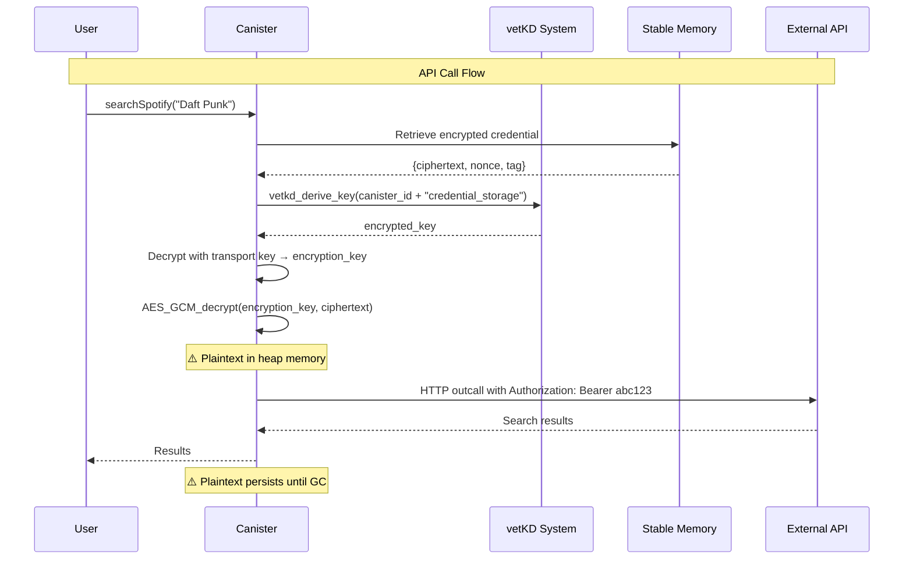
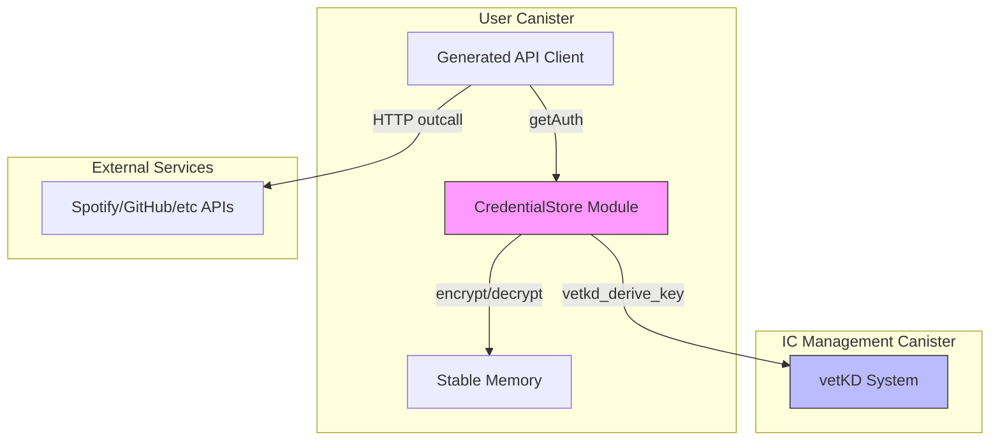
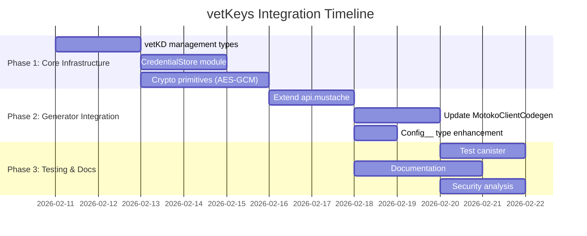
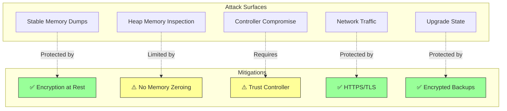
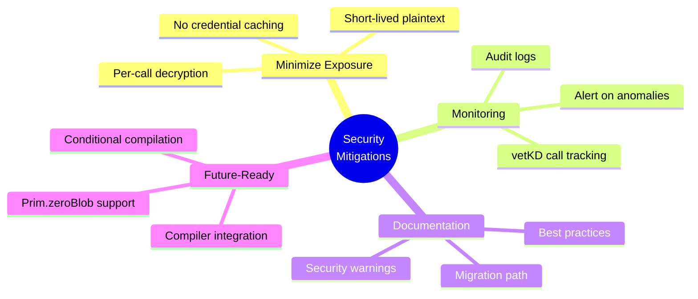
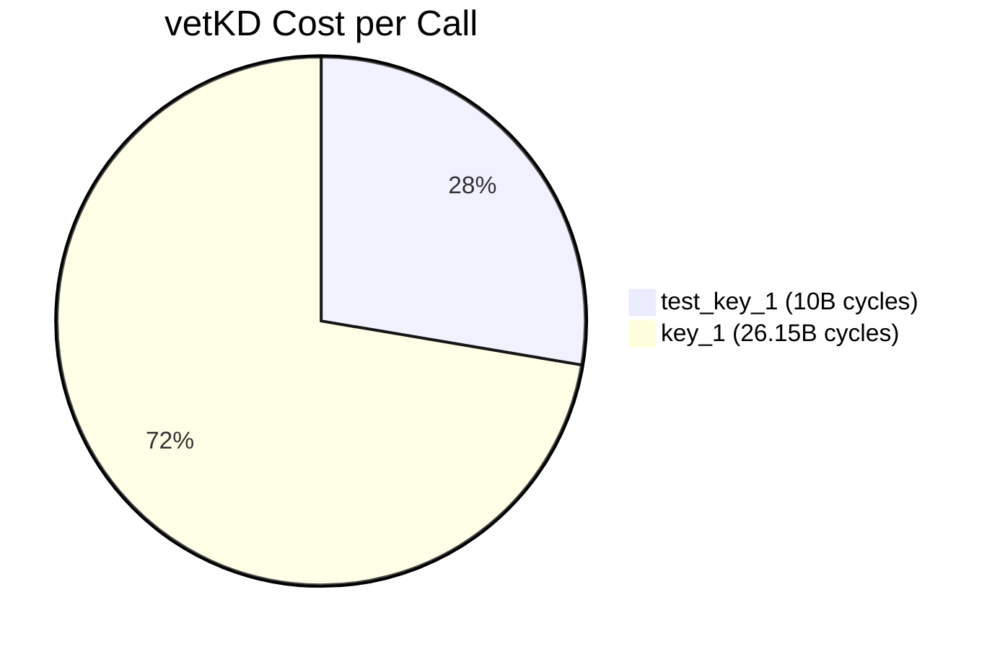
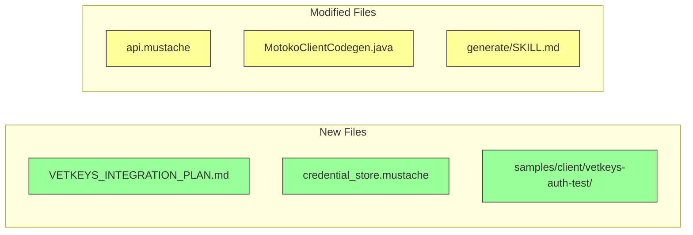
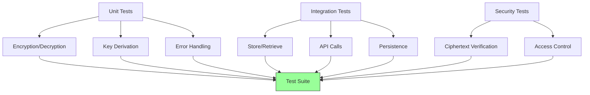

# vetKeys Integration Plan for OpenAPI Generator

## Goal

Add support for secure credential storage using Internet Computer vetKeys, allowing canisters to store API credentials encrypted at rest and decrypt them on-demand for HTTP outcalls.

## Architecture: Option B - Canister-Derived Symmetric Encryption

### Overview

Use vetKD to derive a canister-specific symmetric encryption key, then use that key to encrypt/decrypt credentials stored in canister stable memory.





### Component Architecture



## API Design

### Types

```motoko
// Generated in api.mustache or separate CredentialStore.mo module
module CredentialStore {
    public type EncryptedCredential = {
        ciphertext : Blob;
        nonce : Blob;           // AES-GCM nonce
        created_at : Nat64;     // Timestamp
        key_name : Text;        // Which vetKD key was used
    };

    public type CredentialName = Text;  // e.g., "spotify_token", "github_api_key"

    public type DecryptedAuth = {
        #bearer : Text;
        #apiKey : Text;
        #basicAuth : { user : Text; password : Text };
    };
}
```

### Storage

```motoko
// In generated code or user canister
import Map "mo:core/pure/Map";

stable let encryptedCredentials : Map<Text, EncryptedCredential> = Map.empty();
```

### Core Methods

```motoko
// Store a credential (admin/setup function)
public shared({caller}) func storeCredential(
    name : CredentialName,
    authType : Text,          // "bearer" | "apiKey" | "basicAuth"
    value : Text              // For basicAuth: "username:password"
) : async Result<(), Text> {
    // Only authorized principals can store credentials
    if (not isAuthorized(caller)) {
        return #err("Unauthorized");
    };

    // 1. Derive encryption key
    let encryptionKey = await deriveEncryptionKey();

    // 2. Encrypt the credential
    let encrypted = encryptCredential(encryptionKey, authType, value);

    // 3. Store in stable memory
    encryptedCredentials := Map.put(
        encryptedCredentials,
        Text.compare,
        name,
        encrypted
    );

    #ok(())
};

// Retrieve and decrypt a credential (internal use)
private func getDecryptedCredential(
    name : CredentialName
) : async ?DecryptedAuth {
    // 1. Retrieve encrypted credential
    switch (Map.get(encryptedCredentials, Text.compare, name)) {
        case null { null };
        case (?encrypted) {
            // 2. Derive same encryption key
            let encryptionKey = await deriveEncryptionKey();

            // 3. Decrypt
            switch (decryptCredential(encryptionKey, encrypted)) {
                case (#ok(auth)) { ?auth };
                case (#err(_)) { null };
            };
        };
    };
};

// Helper: Derive encryption key using vetKD
private func deriveEncryptionKey() : async Blob {
    // This uses the canister's own identity to derive a consistent key
    let managementCanister = actor("aaaaa-aa") : ManagementCanister;

    let args = {
        input = Text.encodeUtf8(Principal.toText(Principal.fromActor(this)) # ".credential_storage");
        context = Text.encodeUtf8("openapi-generator-motoko-v1");
        transport_public_key = await getCanisterTransportPublicKey();  // Derive or store
        key_id = {
            curve = #bls12_381_g2;
            name = "test_key_1";  // Use "key_1" for production
        };
    };

    let result = await managementCanister.vetkd_derive_key(args);

    // Decrypt the encrypted_key using transport private key
    decryptWithTransportKey(result.encrypted_key)
};
```

### Integration with Generated API

```motoko
// In generated DefaultApi.mo
public func searchSpotify(
    credentialName : ?Text,  // NEW: Optional credential name
    query : Text
) : async* Result {
    // Build base config
    var config : Config__ = {
        baseUrl = "https://api.spotify.com/v1";
        auth = null;
        cycles = 30_000_000_000;
        // ...
    };

    // If credential name provided, decrypt and add to config
    switch (credentialName) {
        case (?name) {
            let auth = await getDecryptedCredential(name);
            config := { config with auth = auth };
        };
        case null { /* no auth */ };
    };

    // Make API call with decrypted credential
    await* search(config, query)
};
```

## Implementation Phases



### Phase 1: Core Encryption Infrastructure (Week 1)

1. **Add vetKD management canister types** to generator
   - Import types from ic.did
   - Add to api.mustache template

2. **Create CredentialStore module**
   - Encryption/decryption helpers (AES-GCM)
   - vetKD key derivation wrappers
   - Storage management (Map<Text, EncryptedCredential>)

3. **Add crypto primitives**
   - Use existing IC crypto libraries or implement AES-GCM
   - Consider: https://mops.one/ for crypto packages
   - Or use vetKD-derived keys with simple XOR (less secure but simpler MVP)

### Phase 2: Generator Integration (Week 1-2)

1. **Extend api.mustache template**
   - Add CredentialStore module generation
   - Add credential management methods
   - Add optional credential name parameter to operations

2. **Update MotokoClientCodegen.java**
   - Add vendor extension: `x-credential-name` for operations
   - Generate credential store initialization code
   - Add documentation comments about vetKeys usage

3. **Update Config__ type** (optional enhancement)
   ```motoko
   public type Config__ = {
       baseUrl : Text;
       auth : ?Auth__;
       credentialName : ?Text;  // NEW: Fetch from vetKeys store
       // ... existing fields
   };
   ```

### Phase 3: Testing & Documentation (Week 2)

1. **Create test canister**
   - Store test credentials
   - Make API calls using stored credentials
   - Verify encryption/decryption works
   - Test with httpbin.org for validation

2. **Documentation**
   - Update /generate skill with vetKeys examples
   - Add security warnings about memory persistence
   - Document credential setup workflow
   - Add examples for different auth types

3. **Security analysis**
   - Document threat model
   - Explain limitations without compiler zeroing
   - Best practices for production use

## Security Analysis

### Threat Model



### ✅ Security Benefits

1. **Credentials encrypted at rest**
   - Stable memory contains only ciphertext
   - State backups don't expose plaintext
   - Upgrade snapshots safe

2. **No credentials in code**
   - Credentials stored separately from canister logic
   - Can rotate without redeployment

3. **Access control**
   - Only authorized principals can store/manage credentials
   - Generated code handles decryption transparently

### ⚠️ Security Limitations (Without Compiler Support)

1. **Plaintext in heap memory during API calls**
   - Decrypted credential exists as Text/Blob in Wasm heap
   - Persists across await points (state serialization)
   - Controller can potentially dump memory
   - No explicit zeroing available in Motoko

2. **Encryption key derivation observable**
   - vetKD calls visible in canister logs/metrics
   - Frequency reveals API call patterns

3. **Single-point controller compromise**
   - Canister controller can modify code to exfiltrate credentials
   - No isolation from controller (inherent IC limitation)

4. **GC timing non-deterministic**
   - Credential may remain in old heap regions
   - Memory pages may not be zeroed before reuse

### 🎯 Mitigation Strategies



## Encryption Strategy

### Option 1: AES-GCM with vetKD-derived key (Recommended)

```motoko
// Derive 256-bit AES key from vetKD
let aesKey = SHA256(vetKD_derived_key)[0..32];

// Encrypt with AES-GCM
let (ciphertext, nonce, tag) = AES_GCM_256_encrypt(aesKey, plaintext);

// Store all components
store({ ciphertext; nonce; tag });
```

**Pros:**
- Industry-standard encryption
- Authenticated encryption (prevents tampering)
- Strong security guarantees

**Cons:**
- Requires AES-GCM implementation (library dependency)
- More complex integration

### Option 2: XOR with vetKD-derived keystream (MVP)

```motoko
// Derive keystream from vetKD
let keystream = SHA256(vetKD_derived_key || nonce);

// XOR plaintext with keystream
let ciphertext = xor(plaintext, keystream);
```

**Pros:**
- Simple implementation
- No external dependencies
- Fast encryption/decryption

**Cons:**
- Not authenticated (vulnerable to tampering)
- Weaker security than AES-GCM
- Requires careful nonce management

**Recommendation:** Start with Option 2 for MVP, document limitations, upgrade to Option 1 for production.

## vetKD Configuration

### Key Derivation Parameters

```motoko
{
    input = Text.encodeUtf8(
        Principal.toText(canister_id) # ".credential_storage"
    );
    context = Text.encodeUtf8("openapi-generator-motoko-v1");
    key_id = {
        curve = #bls12_381_g2;
        name = "test_key_1";  // Development
        // name = "key_1";    // Production (costs ~$0.035/call)
    };
}
```

### Cost Considerations



- **test_key_1**: 10B cycles (~$0.014 per vetKD call)
- **key_1**: 26.15B cycles (~$0.035 per vetKD call)

**Strategy:**
- Cache encryption key in canister memory (not stable)
- Derive once per canister initialization
- Re-derive after upgrade (not persisted)
- Amortize cost across multiple API calls

## Transport Key Management

**Challenge:** vetKD returns encrypted keys that need decryption with a transport private key.

**Options:**

### A. Generate transport key pair in canister
```motoko
stable var transportPrivateKey : ?Blob = null;

// On first init
if (transportPrivateKey == null) {
    let (privKey, pubKey) = generateKeyPair_BLS12_381();
    transportPrivateKey := ?privKey;
};
```

**Issues:**
- Private key stored in stable memory (defeats encryption at rest)
- Need BLS12-381 key generation (library dependency)

### B. Derive transport key from canister identity
```motoko
// Deterministic derivation from canister's identity
let seed = SHA256(Principal.toText(Principal.fromActor(this)));
let (privKey, pubKey) = deriveKeyPair(seed);
```

**Issues:**
- Seed stored or re-derived (still plaintext)
- Deterministic = same key after upgrade

### C. Use IC-managed keys (if available)

Research if IC management canister can handle transport key decryption internally without exposing private key to canister.

**Recommendation:** Start with Option B for MVP, investigate Option C for production.

## Example Usage

### Setup (Admin)

```motoko
// 1. Deploy canister with generated API client

// 2. Store credentials (one-time setup)
await myCanister.storeCredential(
    "spotify_token",
    "bearer",
    "BQDxO8F...actual-token-here"
);

await myCanister.storeCredential(
    "github_api_key",
    "apiKey",
    "ghp_abc123..."
);
```

### Runtime (User)

```motoko
// Option A: Explicit credential name
let results = await myCanister.searchSpotify(
    ?"spotify_token",  // Credential name
    "Daft Punk"        // Search query
);

// Option B: Default credential (configured in canister)
let results = await myCanister.searchSpotify(
    null,              // Use default
    "Daft Punk"
);
```

### Generated Code

```motoko
// In generated DefaultApi.mo
public func searchSpotify(
    credentialName : ?Text,
    query : Text
) : async* Result {
    // Fetch credential if specified
    let auth = switch (credentialName) {
        case (?name) { await CredentialStore.getAuth(name) };
        case null { null };
    };

    let config = {
        baseUrl = "https://api.spotify.com/v1";
        auth;
        cycles = 30_000_000_000;
        max_response_bytes = null;
        transform = null;
        is_replicated = null;
    };

    await* search(config, query)
};
```

## Files to Create/Modify



### New Files
1. `.claude/VETKEYS_INTEGRATION_PLAN.md` (this file)
2. `modules/openapi-generator/src/main/resources/motoko/credential_store.mustache`
3. `samples/client/vetkeys-auth-test/` - Example canister

### Modified Files
1. `modules/openapi-generator/src/main/resources/motoko/api.mustache`
   - Add CredentialStore import
   - Add credential fetching logic
   - Add optional credentialName parameter

2. `modules/openapi-generator/src/main/java/org/openapitools/codegen/languages/MotokoClientCodegen.java`
   - Add `x-vetkeys-enabled` vendor extension
   - Generate credential management code
   - Add documentation

3. `.claude/skills/generate/SKILL.md`
   - Add vetKeys usage documentation
   - Security warnings
   - Setup examples

## Testing Plan



### Unit Tests
- Encryption/decryption correctness
- Key derivation consistency
- Error handling (missing credentials, decryption failures)

### Integration Tests
1. **Store and retrieve credentials**
   - Store bearer token
   - Retrieve and verify
   - Multiple credentials

2. **API calls with stored credentials**
   - httpbin.org /bearer endpoint
   - Verify Authorization header
   - Test all auth types

3. **Persistence across upgrades**
   - Store credential
   - Upgrade canister
   - Verify credential still accessible

4. **Security tests**
   - Verify stable memory contains only ciphertext
   - Test unauthorized access attempts

## Future Enhancements

### When compiler support available

```motoko
public func searchSpotify(credentialName : Text, query : Text) : async* Result {
    let credential = await CredentialStore.getAuth(credentialName);

    #if (has_prim "zeroBlob")
        // Secure: zero after use
        let config = { baseUrl = "..."; auth = ?credential; ... };
        await* (with cleaning = Prim.zeroBlob(credential))
            search(config, query)
    #else
        // Fallback: current implementation
        let config = { baseUrl = "..."; auth = ?credential; ... };
        await* search(config, query)
    #endif
};
```

## References

- [vetKD API Documentation](https://docs.internetcomputer.org/building-apps/network-features/vetkeys/api)
- [IC Management Canister Interface](https://raw.githubusercontent.com/dfinity/sdk/refs/heads/master/src/dfx/src/util/ic.did)
- [vetKeys GitHub Repository](https://github.com/dfinity/vetkeys)
- [VETKEYS_SECURITY_ANALYSIS.md](.claude/VETKEYS_SECURITY_ANALYSIS.md) - Detailed security analysis

## Decision Log

- **2026-02-11**: Chose Option B (canister-derived symmetric encryption) for initial implementation
- **Next**: Implement MVP with XOR encryption, upgrade to AES-GCM later
- **Future**: Integrate compiler primitives when available for memory zeroing
